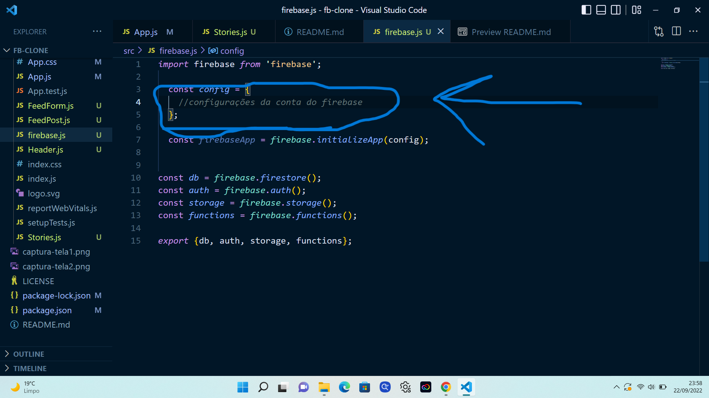
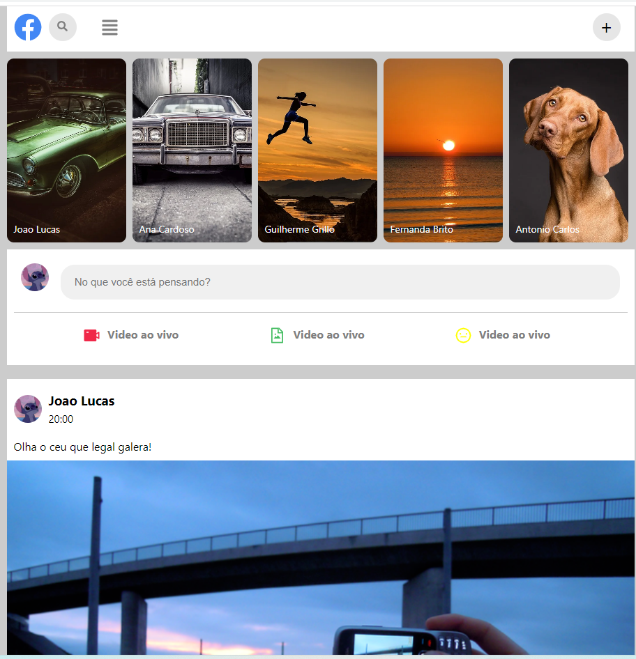
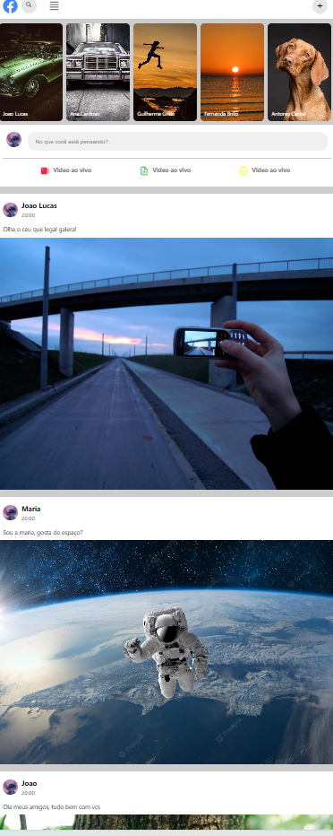

# facebook-clone

### Clone da pagina incial do Facebook com sistema de poste por Firebase
## Versão basica

* Html
* Javascript
* React
* Firebase v8
* CSS

* Comandos para iniciar a aplicação: 

  
<b>
   npm install react-icons --save 
   npm install firebase@8.10.0 
   npm start 
  <b>

* Primeira Captura de Tela   
* ###### Para usar o firebase, defina as configurações da conta. 

* Segunda Captura de Tela   
 

* Terceira Captura de Tela    

